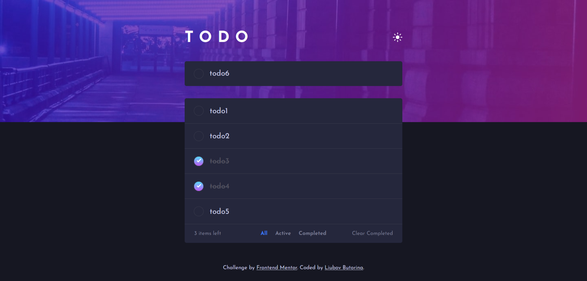
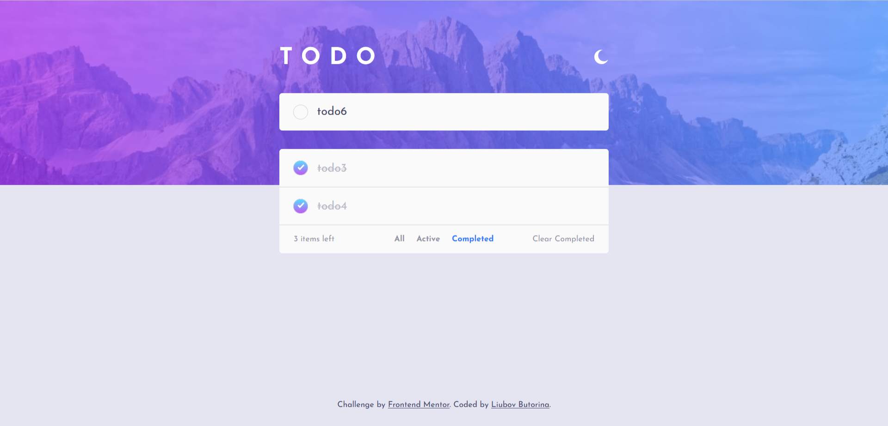
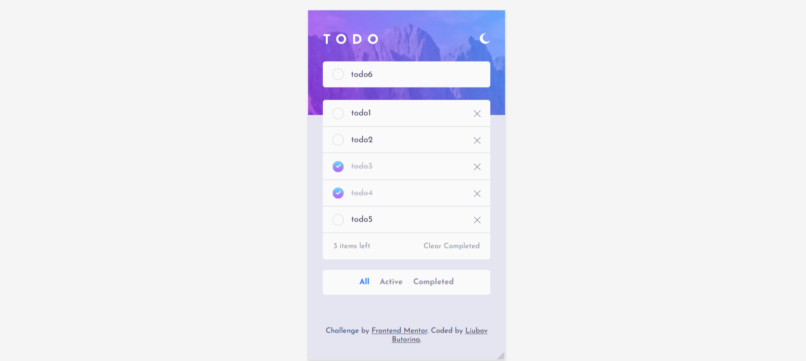
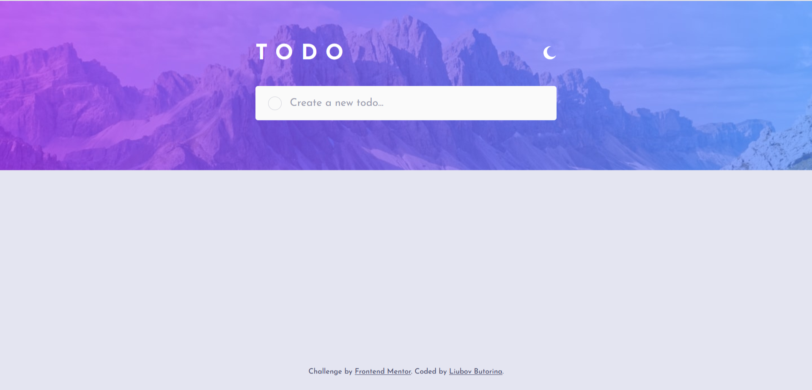
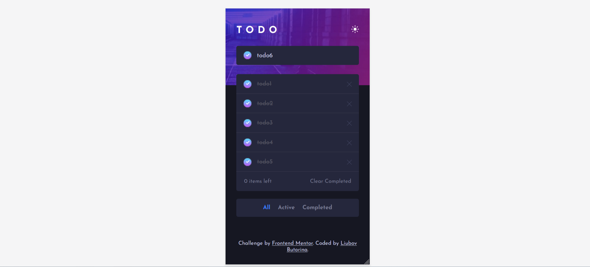

# Todo App Portfolio Project

This is a solution to the [Todo app challenge on Frontend Mentor](https://www.frontendmentor.io/challenges/todo-app-Su1_KokOW). 

- [DEMO](https://liubovbutorina7.github.io/todo-app-main/)

## Application functionality:

Users should be able to:
- add new todos to the list
- mark todos as complete
- delete todos from the list
- filter by all/active/complete todos
- clear all completed todos
- toggle light and dark mode

## Built with:

- Semantic HTML5 markup
- CSS custom properties
- JavaScript
- Flexbox
- Parcel

## Screenshorts:

- initial state (data are loaded from Local Storage)
 

- active state

- dark mode

- adaptive view (screen's width is equal to 375px)

## Author:

_Liubov Butorina_